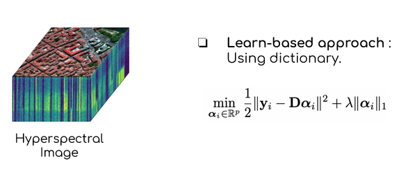

# Sparsity-and-patch-for-image-restoration-
An implementation of  " Bodrito et al. 2021, A Trainable Spectral-Spatial Sparse Coding Model for Hyperspectral Image Restoration "

In this repository we try to restore a Hyperspectral image using a Learning Based approach using the dictionnary method.

